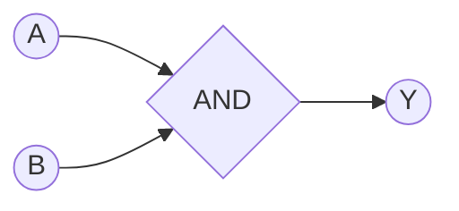

La puerta AND da 1 solo si **ambas** entradas son 1:

$$
Y = A \cdot B
$$

```mermaid
flowchart LR
    A((A)) --> AND{AND}
    B((B)) --> AND
    AND --> Y((Y))
```

Imágenes: guárdalas en `content/assets/` y enlázalas con `![[circuito.png]]`.

Volver a [[index]].