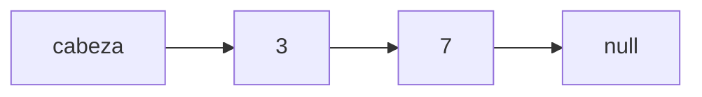

Una lista enlazada es una secuencia de nodos, cada uno con un dato y un puntero al siguiente.

```c
typedef struct Nodo {
    int dato;
    struct Nodo *siguiente;
} Nodo;
```

## Complejidad

| Operación            | Coste |
|----------------------|-------|
| Insertar al inicio   | $O(1)$ |
| Buscar               | $O(n)$ |

## Esquema



> [!warning] Ojo
> Libera siempre la memoria de cada nodo con `free()`.

Relacionado: [[electronica/Puertas lógicas]]